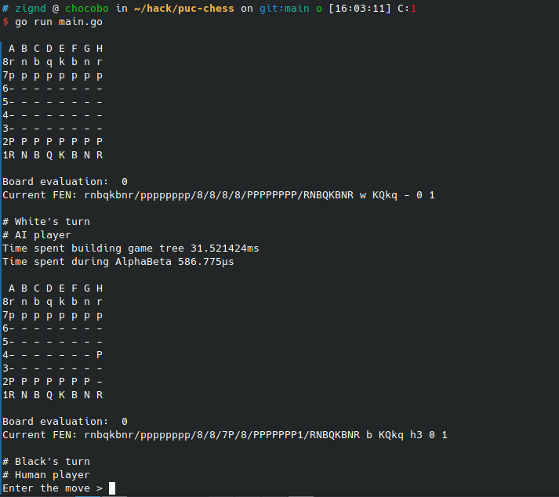
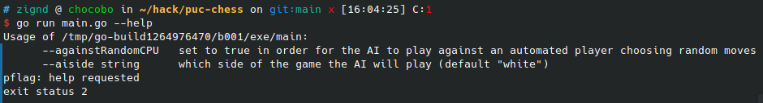

# puc-chess

Simple chess game that implements the Alpha-Beta algorithm. You can play against the algorithm or you can enable a randomized mode in which you can just watch the game play by itself.

## Usage

```
# Run the game
go run main.go

# Display additional parameters
go run main.go --help
```

## Gameplay




